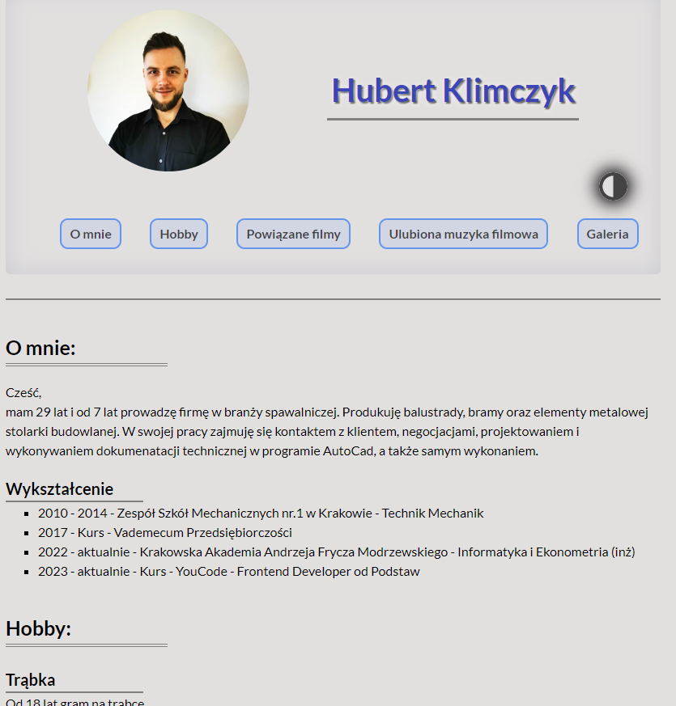

# My first simple homepage site

[link to my website](https://hubertklimczyk.github.io/homepage/)

## General info:
This simple website created for practising basic **HTML, CSS** and **JavaScript** skills.

## Technologies used:
- BEM
- ES6+ features